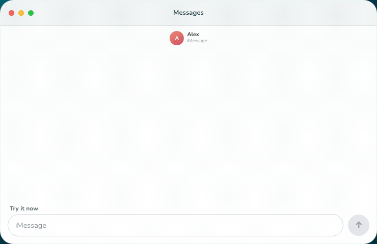
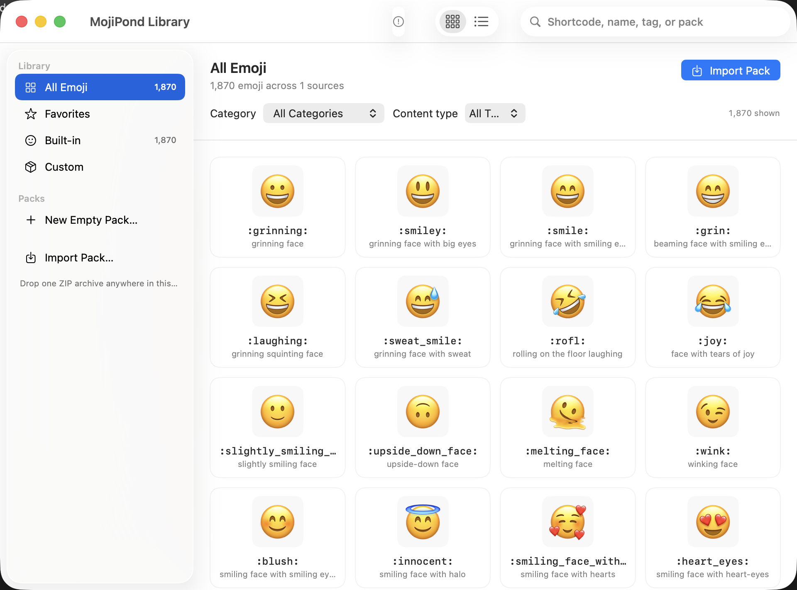
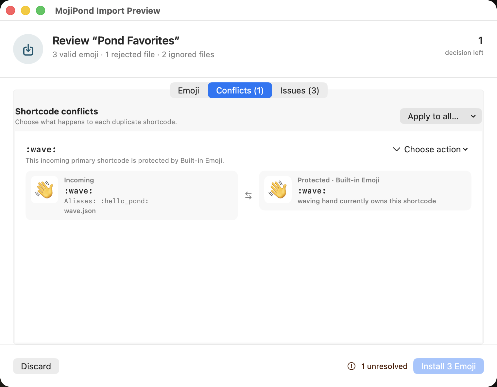

<p align="center">
  <a href="https://mojipond.com">
    
  </a>
</p>

<h1 align="center">MojiPond</h1>

<p align="center"><strong>Type <code>:wave:</code> Get 👋</strong></p>

<p align="center">
  Slack-style emoji autocomplete for macOS, with the Unicode catalog and your own custom packs.
</p>

<p align="center">
  <a href="https://github.com/iamrajjoshi/mojipond/actions/workflows/ci.yml"></a>
  <a href="#build-from-source"></a>
  <a href="https://www.swift.org/"></a>
  <a href="LICENSE"></a>
</p>

<p align="center">
  <a href="https://mojipond.com">Website</a> ·
  <a href="docs/COMPATIBILITY.md">Compatibility</a> ·
  <a href="docs/PRIVACY.md">Privacy</a> ·
  <a href="SECURITY.md">Security</a>
</p>

<p align="center">
  <a href="https://mojipond.com">
    
  </a>
</p>

> [!NOTE]
> **Pre-release:** MojiPond does not have a notarized public download yet.
> Source builds are for development and local testing. The
> [compatibility ledger](docs/COMPATIBILITY.md) records what has been checked in
> real macOS apps.

## What it does

- Opens a five-item picker beside the cursor when you type a colon and part of
  an emoji name. Use the arrow keys to choose, then Tab or Return to insert.
- Includes Unicode emoji, aliases, skin-tone variants, recents, and local
  search ranking. Exact tokens such as `:wave:` replace immediately, while `::`
  opens the full browser.
- Imports ZIP packs made from image folders, a `mojipond.json` manifest, or a
  Slack `emoji.json` file with local artwork. You review names and conflicts
  before installation.
- Inserts custom image emoji in Messages. On macOS 15 or newer, static artwork
  and the first frame of an animation become inline glyphs; the original file
  stays in the library.
- Keeps shortcut matching and pack processing on the Mac. It skips secure
  fields, password managers, terminals, remote desktop apps, chat apps with
  native emoji shortcuts, and apps or websites on your exclusion list.

## Build from source

You need macOS 13 or newer, Xcode with the macOS SDK, and
[XcodeGen 2.46.0](https://github.com/yonaskolb/XcodeGen). Release builds are
Universal binaries for Apple silicon and Intel Macs. See the
[compatibility ledger](docs/COMPATIBILITY.md) for the hardware and macOS
versions tested so far.

```sh
brew install xcodegen
git clone https://github.com/iamrajjoshi/mojipond.git
cd mojipond
./scripts/test.sh
./scripts/install-local.sh
```

`install-local.sh` builds MojiPond, checks the app bundle, installs it at
`/Applications/MojiPond.app`, and launches it. It uses the sole valid Apple
Development identity in your Keychain when one is available; otherwise it uses
an ad-hoc signature. If more than one valid identity is present, set
`MOJIPOND_SIGNING_IDENTITY` to the one you want.

macOS ties privacy permissions to the app's signing identity. Changing that
identity can make the system ask for access again.

To build without installing:

```sh
./scripts/build.sh Debug
```

Local builds are not ready for distribution. Developer ID signing,
notarization, and release packaging are covered in the
[release guide](docs/RELEASING.md).

## First use

1. Open **MojiPond → Setup & Permissions** from the menu bar.
2. Grant Input Monitoring and Accessibility.
3. Type `:wa` in a supported text field.
4. Choose with Up or Down Arrow, then press Tab or Return.

| Input    | Result                                      |
| -------- | ------------------------------------------- |
| `:wa`    | Opens matching suggestions                  |
| `:wave:` | Inserts the exact Unicode match             |
| `::`     | Opens the searchable emoji browser          |
| Escape   | Closes the picker without changing the text |

Settings let you change the trigger, acceptance keys, login behavior,
exclusions, and whether a bare colon shows suggestions.

## Permissions and privacy

| Permission                              | Why it is needed                                                                                  |
| --------------------------------------- | ------------------------------------------------------------------------------------------------- |
| Input Monitoring                        | Notices the trigger and picker navigation keys while another app is active                        |
| Accessibility                           | Finds the active editable field, places the picker by the cursor, and replaces the selected token |
| Image emoji in Messages (Event Posting) | Optionally posts paste and Return events for custom images in Messages                            |

Unicode replacement does not need Event Posting when the target supports
direct Accessibility replacement. MojiPond does not request Screen Recording,
Full Disk Access, Contacts, or access to the Messages database.

Autocomplete and pack processing stay on the Mac. There are no accounts or
usage analytics. First-run setup shows the Sentry crash-reporting choice before
the SDK starts; it defaults to on and remains available under
**Settings → Privacy**. Automatic update checks default to off. The
[privacy document](docs/PRIVACY.md) lists stored data and network behavior.

## Custom emoji packs

The Library imports one local ZIP at a time. A ZIP can contain:

- a folder of PNG, JPEG, GIF, or WebP files;
- a portable `mojipond.json` pack with image or Unicode entries;
- a Slack `emoji.json` file whose artwork is included in the archive.

Before installation, MojiPond shows normalized names, ignored files, duplicate
artwork, and naming conflicts. The import UI does not fetch remote pack assets.
See the [pack format](docs/PACK_FORMAT.md) for the manifest schema, image limits,
path rules, and export format.

## Screenshots

| Emoji library                                           | Import review                                                       |
| ------------------------------------------------------- | ------------------------------------------------------------------- |
|  |  |

## Troubleshooting

<details>
<summary><strong>The picker does not appear</strong></summary>

- Confirm that the menu bar says **Enabled** and both required permissions are
  granted.
- Try TextEdit or Notes. Some custom editors do not expose enough Accessibility
  information for safe replacement.
- Check the app and website exclusion lists. Secure fields are always skipped.

</details>

<details>
<summary><strong>Permissions disappear after a rebuild</strong></summary>

Development and ad-hoc signatures can change the identity macOS associates
with a permission. Install the copy at `/Applications/MojiPond.app`. If a stale
entry remains, remove it from the relevant Privacy & Security list, add the
installed app again, and relaunch.

</details>

<details>
<summary><strong>A custom image will not insert</strong></summary>

Image emoji work only in Messages and need optional Event Posting access. When
insertion cannot run safely, use **Copy Media Instead** from the MojiPond menu
and paste it yourself.

</details>

## Project documentation

| Topic                                        | Document                                         |
| -------------------------------------------- | ------------------------------------------------ |
| App structure and safety boundaries          | [Architecture](docs/ARCHITECTURE.md)             |
| Verified behavior and pending manual checks  | [Compatibility](docs/COMPATIBILITY.md)           |
| ZIP and manifest rules                       | [Pack format](docs/PACK_FORMAT.md)               |
| Local data and network features              | [Privacy](docs/PRIVACY.md)                       |
| Signing, notarization, updates, and releases | [Release guide](docs/RELEASING.md)               |
| Website development                          | [Website README](website/README.md)              |
| Artwork and third-party sources              | [Third-party assets](docs/THIRD_PARTY_ASSETS.md) |

## Contributing

Open an issue before a large change so the approach can be discussed. Before
submitting code, run the checks for the part you changed.

```sh
# Native app
./scripts/test.sh

# Website
pnpm site:format:check
pnpm site:check
pnpm site:build
pnpm site:test
```

CI also scans for secrets, checks shell scripts, builds the Universal Release
configuration, and runs the website's browser tests.

## License and security

MojiPond is available under the [MIT License](LICENSE). Third-party code and
artwork, including Sparkle's updater framework, keep the licenses listed in
`ThirdParty/` and `Resources/THIRD-PARTY-NOTICES.txt`.

Report security problems through
[GitHub private vulnerability reporting](https://github.com/iamrajjoshi/mojipond/security/advisories/new),
not a public issue. See [SECURITY.md](SECURITY.md) for the reporting policy.
