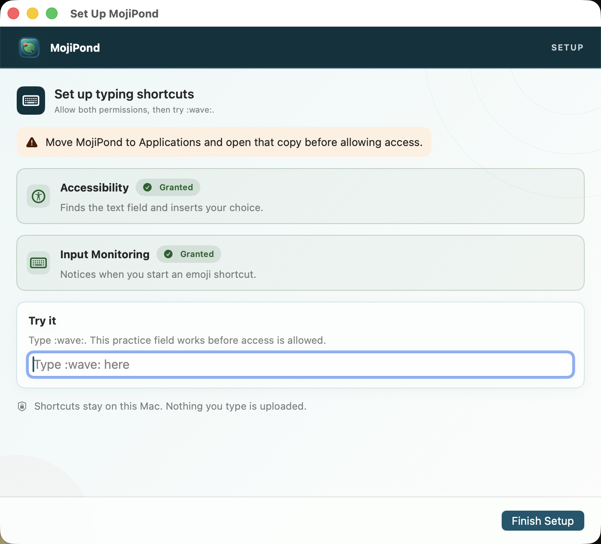
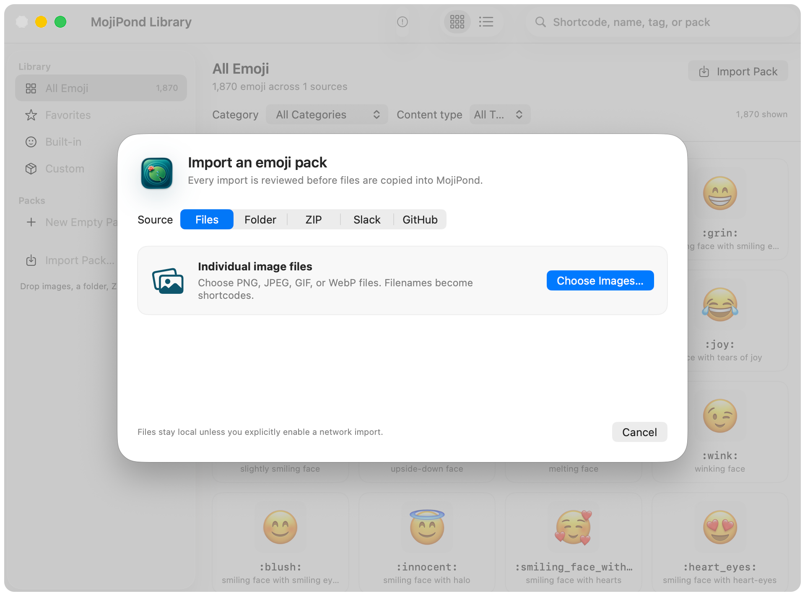
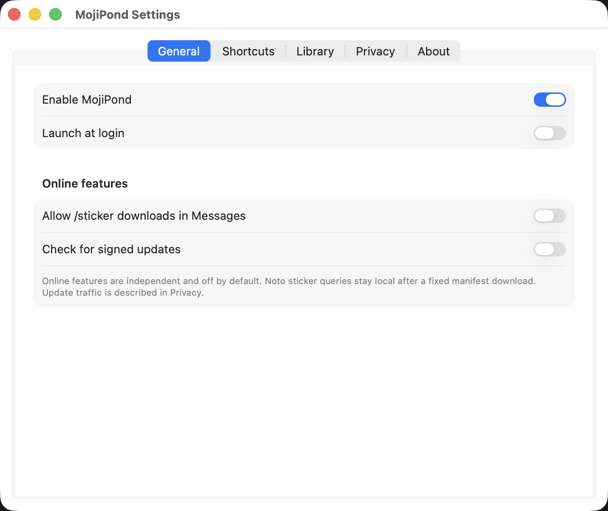
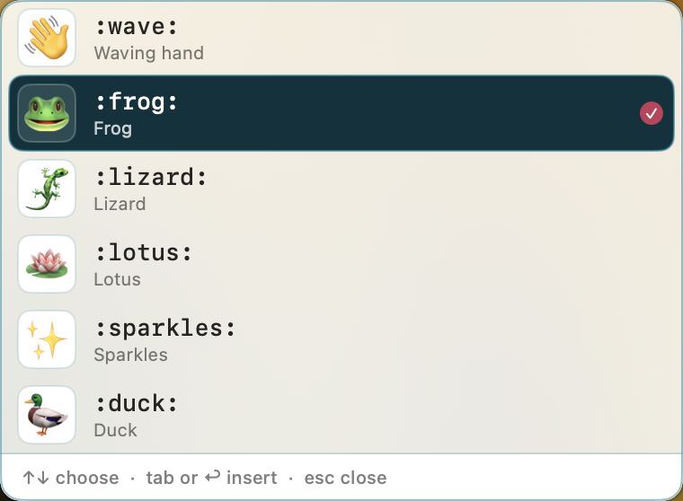
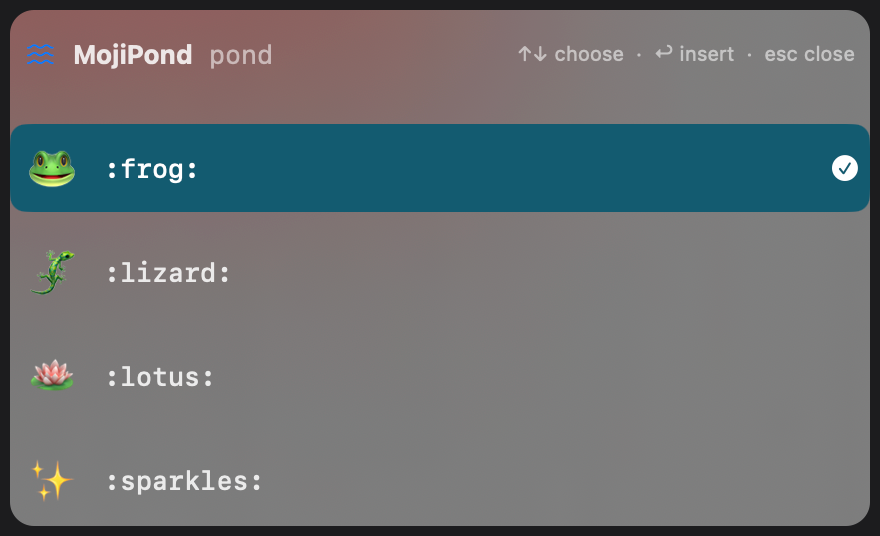
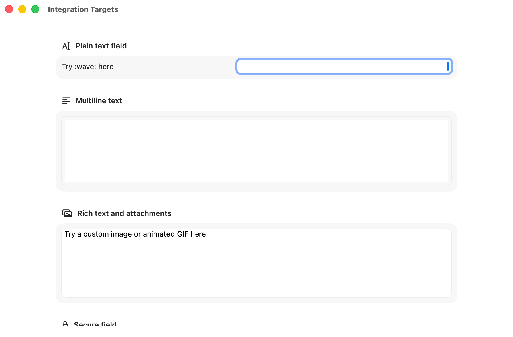

# MojiPond

[mojipond.com](https://mojipond.com)

MojiPond is a native macOS menu-bar app for Slack-style emoji autocomplete.
Type a shortcode such as `:wave:`, choose a result beside the caret, and keep
typing. It also includes a local custom-pack library, bounded ZIP imports, and
a Messages-only sticker command.

> **Pre-release status:** global Unicode autocomplete, the custom-pack Library,
> and Messages media commands are connected to the app and exercised by
> automated tests. They have not all been manually verified against real
> third-party editors or Messages. Treat this as a personal development build,
> not a notarized public release. The evidence ledger is in
> [docs/COMPATIBILITY.md](docs/COMPATIBILITY.md).

## Highlights

- Native AppKit and SwiftUI menu-bar application; no browser extension or
  background server.
- Built-in Unicode emoji catalog with aliases, search ranking, recents, and
  skin-tone variants.
- Configurable trigger, Tab and Return acceptance, exact closing-token
  replacement, and a double-trigger browser.
- Fail-closed handling for secure fields, unknown targets, excluded apps, and
  excluded browser domains.
- Local Unicode, PNG, JPEG, GIF, and WebP pack model with aliases and
  metadata.
- A bounded, preview-first ZIP import UI for portable `mojipond.json` packs,
  simple image folders, and Slack-style `emoji.json` packs contained in an
  archive.
- Offline Noto Animated Emoji subset plus opt-in online Noto results for the
  Messages sticker workflow.
- Enabled custom Unicode and image entries participate in `:query`, exact
  `:name:`, and `::` browsing beside the built-in catalog.
- Media insertion snapshots all pasteboard items and representations before a
  temporary paste, then restores them unless another process changed the
  pasteboard.
- Signed update checks plus an explicit, bounded download-and-verify flow for a
  single Developer ID-signed, hardened, Gatekeeper-accepted app. MojiPond
  installs only after **Install & Relaunch**, with a locked atomic swap,
  post-launch readiness acknowledgement, and rollback.
- No accounts, message-database access, or usage analytics. Crash and hang
  reporting is enabled by default and can be disabled at any time in
  **Settings → Privacy**.

## Product tour

These captures come from the isolated macOS UI-test harness and contain only
MojiPond windows or panels.

| Permission setup | Library |
| --- | --- |
|  |  |
| ZIP import | Settings |
|  |  |
| Import review | Caret suggestions |
|  |  |
| Double-trigger browser | Native integration fixture |
|  |  |

Additional permission states and a dark ZIP-import screenshot are in
[`docs/screenshots`](docs/screenshots).

## Requirements

- macOS 14 or newer (deployment target; older releases are unsupported).
- Xcode with the macOS SDK. The currently exercised toolchain is recorded in
  [docs/COMPATIBILITY.md](docs/COMPATIBILITY.md).
- [XcodeGen](https://github.com/yonaskolb/XcodeGen) 2.46.0, the version
  pinned and checksum-verified by CI.

Install XcodeGen with Homebrew if needed:

```sh
brew install xcodegen
```

## Website

The public site lives in `website/` and is built with Astro. The repository
uses pnpm for all website commands:

```sh
corepack enable
pnpm install --frozen-lockfile
pnpm site:check
pnpm site:build
pnpm site:test
```

The site uses reviewed app screenshots from `docs/screenshots/`. Before the
first notarized release, its primary action links to the product tour and says
that the public build is waiting for Apple signing. After a GitHub release is
published, the Pages workflow copies the final DMG, ZIP, checksums, and signed
update feed into the public site. It serves versioned release assets instead of
linking to raw repository files.

Local development is available at `http://localhost:4321`:

```sh
pnpm site:dev
```

## Build and install

For a fresh authenticated checkout:

```sh
git clone \
  https://github.com/iamrajjoshi/mojipond.git
cd mojipond
```

From the repository root:

```sh
./scripts/test.sh
./scripts/build.sh Debug
./scripts/install-local.sh
```

`install-local.sh` builds a development copy, verifies its signature, installs
it at `/Applications/MojiPond.app`, and launches it. For Debug builds,
`build.sh` automatically reuses the sole valid Apple Development identity in
the Keychain search list. This gives local rebuilds a stable signing identity
so macOS can preserve privacy approvals across installs. If no Apple
Development identity is available, Debug builds remain ad-hoc signed. If more
than one is available, set `MOJIPOND_SIGNING_IDENTITY` explicitly to the
intended identity name or fingerprint. An explicit setting always overrides
automatic selection.

Release builds and local release packages remain ad-hoc signed by default.
Developer ID and notarization are still required for public distribution.

To produce a local Universal Release archive, ZIP, DMG, fixed-schema
build-provenance metadata, and SHA-256 checksum file:

```sh
./scripts/package-local.sh
```

Artifacts are written to a new timestamped directory below
`Artifacts/releases/`. Local packages are ad-hoc signed and are not suitable
for public distribution. Developer ID and notarization instructions are in
[docs/RELEASING.md](docs/RELEASING.md).

### UI test harness

`./scripts/test.sh` is the default headless suite used by CI. It does not drive
the pointer or take focus. macOS `XCUIApplication` tests cannot run headlessly
inside the active user session, so routine UI automation runs in the isolated
`macOS UI` GitHub Actions workflow instead.

To deliberately run that suite on a local unlocked desktop:

```sh
MOJIPOND_ALLOW_LOCAL_UI_TESTS=1 ./scripts/test-ui-remote.sh
```

The opt-in guard prevents an accidental local run from taking over the active
screen. The remote workflow stores its `.xcresult` bundle as a downloadable
artifact. Run the separate integration fixture only when validating system
text fields manually:

```sh
xcodebuild \
  -project MojiPond.xcodeproj \
  -scheme MojiPondIntegrationFixture \
  -configuration Debug \
  -destination 'platform=macOS' \
  -derivedDataPath .derived/ui-fixture \
  test \
  CODE_SIGN_IDENTITY=- \
  CODE_SIGNING_REQUIRED=YES
```

The MojiPond UI scheme launches with isolated temporary Library data,
deterministic not-requested/denied/granted/revoked permission scenarios, and
runtime/network startup disabled. It also forces explicit light or dark
appearance and fails if the two Library captures are identical. It does not
request TCC access or interact with Messages. The integration fixture
exercises an ordinary field, multiline editor, secure field, and
attachment-capable rich text view.

## Grant permissions

Open **MojiPond → Setup & Permissions** from the menu-bar item. MojiPond asks
only after you press an Allow button.

| Permission | Why it is used | Required for |
| --- | --- | --- |
| Input Monitoring | Receives keyboard events while another app is active | Global autocomplete |
| Accessibility | Identifies the focused editable control, reads a bounded token near the caret, positions suggestions, and replaces the validated token | Global autocomplete |
| Image emoji in Messages (Event Posting) | Sends tagged Command-V and Return events after validating the target | Custom-image insertion and send-after-insertion |

This third permission is optional. Unicode insertion does not need Event
Posting when the target supports direct Accessibility replacement. MojiPond
does not request Screen Recording,
Full Disk Access, Contacts, or access to the Messages database.

Apple explains these controls in
[Control access to input monitoring on Mac](https://support.apple.com/guide/mac-help/control-access-to-input-monitoring-on-mac-mchl4cedafb6/mac)
and
[Allow accessibility apps to access your Mac](https://support.apple.com/guide/mac-help/allow-accessibility-apps-to-access-your-mac-mh43185/mac).

You can print the app’s preflight view without displaying a consent prompt:

```sh
/Applications/MojiPond.app/Contents/MacOS/MojiPond \
  --print-permissions-and-quit
```

## Use Unicode autocomplete

1. Focus an ordinary editable text field in a non-excluded app.
2. Type `:wa` (or your configured trigger and query).
3. Use Up and Down Arrow to select a suggestion.
4. Press Tab or Return to replace the token.

With the default settings:

- `:wave:` performs an exact replacement when the closing colon is typed.
- `::` opens the emoji browser.
- Escape, a mouse click, cursor movement, or an unsupported modifier dismisses
  the session without changing the text. Pausing does not close the picker.
- The popup is not shown for a bare `:` until that setting is enabled.

Settings let you pause MojiPond, launch it at login, change the trigger and
acceptance keys, turn crash and hang reporting off, opt into online Noto
stickers or signed update checks, and manage app or website exclusions.
Password managers, terminals, virtual-machine clients, Slack, and Discord are
excluded by default.

After onboarding, normal and login-item launches stay in the menu bar without
opening the Library. Open it from the status menu, or launch with
`--mojipond-open-library` when an explicit Library window is required.

## Custom packs and media commands

Open **MojiPond → Emoji Library** to browse, search, and filter built-in and
custom emoji in a grid or list. From the Library you can:

- Import one local ZIP archive at a time with the picker or drag and drop. The
  ZIP may contain a portable `mojipond.json` pack, a Slack-style `emoji.json`
  pack with local assets, or a simple folder of supported images.
- Review thumbnails, normalized shortcodes, ignored or rejected entries,
  duplicate hashes, and collisions before anything is installed.
- Resolve each collision by keeping the existing item, replacing it, renaming
  the import, or dropping an alias; the same choice can be applied to all
  matching conflicts.
- Enable, disable, reorder, inspect, export, and remove imported packs; replace
  a pack from another ZIP; and reveal its managed files.
- Search imported items by shortcode, alias, name, tag, or category, then copy
  their value directly from the Library detail view.

ZIP preparation is local, cancellable, and reviewed before installation.
Replacing an installed pack also requires one ZIP and updates its contents
transactionally.

- Portable pack authors: see [docs/PACK_FORMAT.md](docs/PACK_FORMAT.md), then
  wrap the pack folder in a ZIP before importing it.
- In Messages, type `/sticker <query>` to search the bundled offline Noto
  subset. Online Noto search is a separate opt-in.
- Use the arrow keys or Tab to move through a media grid, Return to insert the
  selected original, and Escape to close it. Media commands and custom-image
  shortcode insertion are restricted to Messages.
- On macOS 15 or later, a validated custom image is inserted in Messages as an
  inline adaptive image glyph. Animated assets use frame 0 as a static glyph
  so they resize with surrounding text, while the original animation remains
  stored unchanged. macOS 14 and glyph-conversion failures retain the existing
  media fallback; failed animated-WebP conversion can use **Copy Media
  Instead**.

## Signed updates

Update checks remain disabled until the app bundles an HTTPS feed and trusted
public key. A manual check, or explicitly enabled background checks, verifies
the signed metadata before showing a release. Background checks run daily; a
previously detected release is checked again on launch before it is shown.
Downloading is a separate user action.

The downloader caps the ZIP at both its signed byte count and a local safety
limit, verifies its SHA-256 digest, extracts exactly one `MojiPond.app` in a
private directory, and validates the current and candidate apps. Both must
have the expected bundle ID, a Developer ID Application signature, Hardened
Runtime, secure timestamp, Gatekeeper acceptance, and the same Team ID. A
local ad-hoc build therefore cannot stage an update.

After a second explicit **Install & Relaunch** confirmation, MojiPond repeats
the archive, bundle, signature, identity, version, and build checks. The
verified candidate then runs the installer mode of the same MojiPond
executable—there is no helper, daemon, or privileged component. It acquires a
sibling lock and consumes a private, one-time handoff bound to the running app
and exact staged candidate. It then waits for the old process to exit, copies
and re-verifies the candidate beside the installed app, atomically exchanges
the two bundles, moves the displaced app to a backup name, and verifies the
final destination before launch. The backup is removed only after the final
app writes a private readiness acknowledgement; failures restore and re-verify
the previous app.

If the installed app's parent directory is not writable, MojiPond opens the
verified candidate in Finder for manual replacement. Unsafe paths or identity
failures never receive that fallback. See
[docs/RELEASING.md](docs/RELEASING.md) for the release-side requirements.

The example environment file contains local build and packaging settings:

```sh
cp .env.example .env
set -a
source .env
set +a
```

The scripts do not load `.env` automatically. Never commit `.env`, signing
credentials, or a real API key.

## Troubleshooting

### The menu says “Permissions needed”

- Confirm the running copy is `/Applications/MojiPond.app`.
- In **System Settings → Privacy & Security**, enable MojiPond under both
  **Input Monitoring** and **Accessibility**.
- Quit and reopen MojiPond after changing access.
- Ad-hoc rebuilds can change the app’s code identity. If macOS retains a stale
  entry, remove MojiPond from the relevant list, add the installed copy again,
  and relaunch it.

### No suggestions appear

- Confirm MojiPond is enabled in the menu.
- Try a standard TextEdit or Notes text field; some custom editors do not
  expose the Accessibility attributes required for validated replacement.
- Check whether the current application or browser domain is excluded.
- Secure fields and fields whose security status cannot be proven are rejected
  deliberately.
- Type one query character after the trigger unless bare-trigger suggestions
  are enabled.

### Tab or Return behaves normally

MojiPond intercepts navigation keys only while its own suggestion surface is
active. If the popup is absent or the target cannot be revalidated, the key is
passed through.

### An image cannot be pasted

Custom-image insertion needs the optional **Image emoji in Messages** access.
When MojiPond cannot capture a complete clipboard snapshot, validate the
target, or post the paste command, the insertion engine leaves the token and
clipboard unchanged and records a copy-fallback notice. If the selected
original passed validation, open the MojiPond menu and choose **Copy Media
Instead** to place it on the clipboard for a manual paste.

### An import is rejected

ZIP imports enforce file-count, byte, dimension, frame-count, archive, and path
limits. Symlinks, path traversal, and non-regular archive entries are rejected.
The current import UI does not fetch remote pack assets. See
[docs/PACK_FORMAT.md](docs/PACK_FORMAT.md) for the exact limits and naming
rules.

## Documentation

- [Architecture](docs/ARCHITECTURE.md)
- [Portable pack format](docs/PACK_FORMAT.md)
- [Privacy model](docs/PRIVACY.md)
- [Compatibility and verification ledger](docs/COMPATIBILITY.md)
- [Release and notarization process](docs/RELEASING.md)

Third-party source notices are kept beside their inputs in `ThirdParty/`; a
complete distributable notice is also bundled at
`Contents/Resources/THIRD-PARTY-NOTICES.txt`, and packaging fails if it is
missing. The bundled Unicode metadata comes from `gemoji`; the offline animated
subset is attributed under `ThirdParty/NotoAnimatedEmoji/`. The MojiPond icon
is original, project-specific artwork—not a third-party logo or emoji. Its
source image is `Resources/Branding/MojiPond-AppIcon-Source.png`; the sized
files in `Resources/Assets.xcassets/AppIcon.appiconset/` derive from that
source.

The public `knobiknows/all-the-bufo` repository is an importer-engine
compatibility fixture, not a source exposed by the current ZIP-only UI or
bundled content. Its 2026-07-28 audit found no detected license or redistribution
grant, so MojiPond does not bundle or redistribute its artwork.

## License

MojiPond is available under the [MIT License](LICENSE). Third-party components
and assets remain subject to the licenses listed in `ThirdParty/` and
`Resources/THIRD-PARTY-NOTICES.txt`.

Please report suspected vulnerabilities through the private process in
[SECURITY.md](SECURITY.md).
